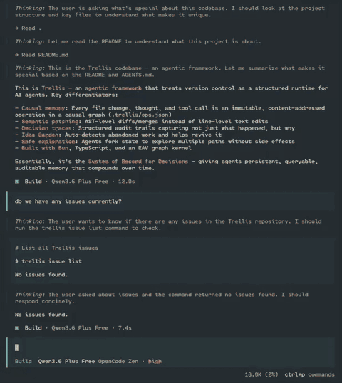

# Trellis

> **The Agentic Framework**

| Use Case                       | How                                                                                                       |
| :----------------------------- | :-------------------------------------------------------------------------------------------------------- |
| **Agentic State Engine**       | Tool registry + decision traces + branching — agents operate on state they can fork, audit, and roll back |
| **Building Agents End-to-End** | Unified LLM abstraction + context management + RAG + orchestration                                        |
| **Autonomous Code Editing**    | Semantic patching + AST-aware tools + causal history                                                      |
| **Auditable Reasoning**        | Immutable op log + decision traces + precedent search                                                     |

---

## Why Trellis?

Most agent frameworks focus on the _reasoning engine_ (the LLM) but treat _state_ as an afterthought. Trellis reverses this. It is the **System of Record for Decisions**, providing agents with a persistent, queryable, and auditable memory that compounds over time.

**[Read the story →](./docs/THE-STORY.md)**

- **Durable Memory**: Every thought, tool call, and file change is an immutable operation in a causal graph
- **Explainability by Default**: Decision traces don't just store _what_ happened, but _why_
- **Safe Exploration**: Agents can "fork" state to explore multiple paths

---

## Quick Start

```bash
# 1. Install
npm install -g trellis

# 2. Initialize a repository
mkdir my-project && cd my-project
trellis init

# The init command now offers two paths:
# ⚡ Minimal Setup: One-shot setup with auto-detected defaults
# 🔧 Custom Guided Setup: Full control over framework, IDEs, and features

# 3. Create content (tracked automatically)
echo "# My Project" > README.md

# 4. Add structured entities
trellis issue create -t "Bootstrap Visualization"
trellis milestone create -m "Initial Release"

# 5. Launch the local web client to explore your semantic graph
trellis web

# 6. Create coding session with trellis harness
trellis code
```

After running `trellis init`, you'll see a progressive disclosure success screen:

**Next steps (VCS):**

- `trellis status` — Check repository status
- `trellis log` — View recent history
- `trellis branch` — List or create branches
- `trellis milestone` — Create narrative checkpoints
- `trellis garden` — Discover abandoned work
- `trellis issue` — Create and track issues

**Semantic Substrate (Live local services):**

- `trellis web` — Launch local web client / graph visualizer
- `trellis query` — Run EQL-S semantic queries against your code graph
- Agent Rules — Active for your IDE. Agents will auto-detect the graph.



See the [CLI guide](https://trellis.computer/docs/cli) for complete documentation.

---

## CMS Client SDK

Use `trellis/cms` from browser apps to read content from a Trellis-compatible HTTP server such as opencode at `http://localhost:4096`.

```typescript
import { createCmsClient } from 'trellis/cms';

const cms = createCmsClient({
  url: 'http://localhost:4096',
  directory: '/path/to/project',
});

const posts = await cms.collection('blogpost').list({
  status: 'all',
  expand: ['author'],
});

const off = cms.collection('blogpost').subscribe(
  (entries) => {
    console.log(entries);
  },
  {
    status: 'published',
    onError: console.error,
  },
);

off();
```

- **Collections**: `cms.collections()` returns `TypeSchema` collections marked with `cms=true`.
- **Schema**: `cms.collection('blogpost').schema()` returns field definitions including types, labels, requirements, formulas, and targets.
- **Normalized keys**: `cms.collection('blogpost')` matches stored entity types like `BlogPost`.
- **References**: `expand` resolves reference ids from facts and graph links into nested entries.
- **Scaffolds**: `scaffoldConsumer({ collection, framework, directory })` generates starter consumer code for vanilla, React, Solid, or Vue.

---

## What is Trellis?

Trellis is an **event-sourced causal graph engine** that unifies version control, knowledge management, and semantic analysis. Every action is an immutable operation in a causal stream:

```typescript
interface VcsOp {
  hash: string; // content-addressed
  kind: VcsOpKind; // e.g. 'vcs:fileModify'
  timestamp: string; // ISO 8601
  agentId: string; // Author identity
  previousHash?: string; // Causal chain link
  vcs: VcsPayload; // Op-specific data
  signature?: string; // Ed25519 signature
}
```

Ops are written to `.trellis/ops.json` and **never rewritten or deleted**.

### Platform Surfaces

| Surface               | Purpose                                  |
| :-------------------- | :--------------------------------------- |
| `trellis` npm package | Core platform APIs via subpaths          |
| `trellis` CLI         | Repository management and automation     |
| VS Code extension     | Visual timeline and knowledge navigation |

---

## Documentation

- **[Documentation hub](./docs/README.md)** — Canonical docs index for Trellis
- **[The Story](./docs/THE-STORY.md)** — Why Trellis exists
- **[Vision](./docs/VISION.md)** — Local-first agentic OS framing
- **[Architecture](./docs/ARCHITECTURE.md)** — Current package layout and target runtime shape
- **[Five Pillars](./docs/PILLARS.md)** — Core architectural principles
- **[Design spec](./docs/DESIGN.md)** — Full architecture specification
- **[Roadmap](./docs/ROADMAP.md)** — Active Trellis issue and milestone sequence
- **[Agents guide](./docs/AGENTS.md)** — Building agents on Trellis
- **[Full documentation](https://trellis.computer)** — Published docs site
- **[CLI reference](./docs/README-ARCHIVED.md#cli-overview)** — Command details (archived)
- **[API modules](./docs/README-ARCHIVED.md#module--subpath-guide)** — Subpath imports (archived)

---

## Development

```bash
# Prerequisites
# Requires Bun ≥ 1.0

# Install dependencies
bun install

# Run tests
bun test

# Build for npm
bun run build
```

---

## Status

| Phase | Deliverable                | Status |
| :---- | :------------------------- | :----- |
| P0    | Causal stream + CLI        | ✅     |
| P0.5  | VS Code extension          | ✅     |
| P1    | Git import bridge          | ✅     |
| P2    | Branches, milestones       | ✅     |
| P2.5  | Blob store, modularization | ✅     |
| P3    | File-level diff + merge    | ✅     |
| P4    | Identity + governance      | ✅     |
| P5    | Idea Garden                | ✅     |

---

_For comprehensive documentation including detailed CLI commands, API examples, and subsystem guides, see [docs/README-ARCHIVED.md](./docs/README-ARCHIVED.md)._
