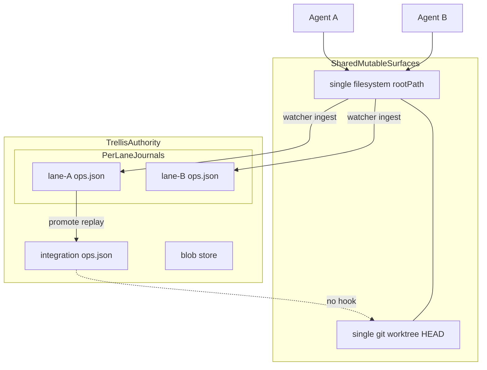
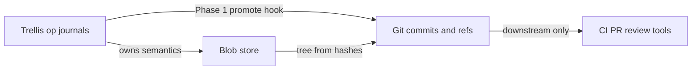
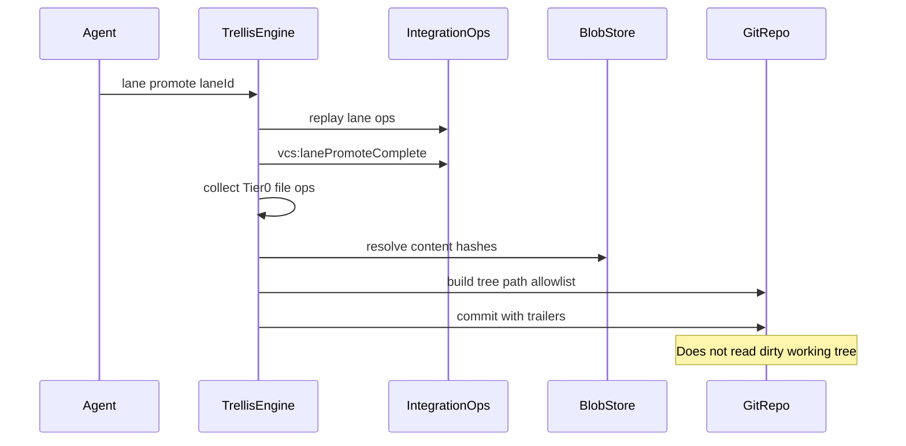
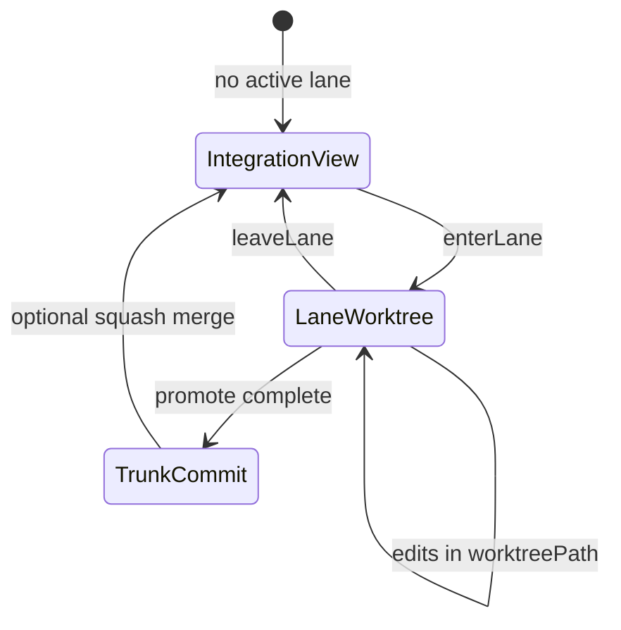
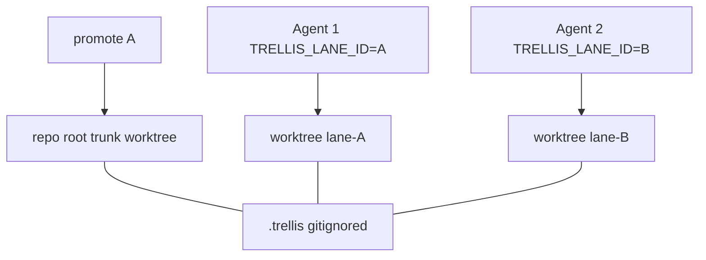

# ADR 0014: Git materialization and lane worktree bind

> **Terminology ([ADR 0005](./0005-agent-lane-naming.md)):** **lane**, `trellis lane promote`, `LaneMeta.worktreePath`, `vcs:lanePromote*`.

**Status:** Accepted  
**Date:** 2026-06-29  
**Issue:** TRL-40 (Phase 2); TRL-TBD (Phase 1)  
**Depends on:** [0001](./0001-workspace-journal-model.md), [0002](./0002-workspace-promote-algorithm.md), [0005](./0005-agent-lane-naming.md), [0006](./0006-session-fork-lane-mapping.md), [0007](./0007-child-fork-lane-base.md)  
**Supersedes:** nothing

## Context

Trellis Agent Lanes isolate **semantic state** in per-lane journals (ADR 0001). Promote replays lane ops onto the integration journal (ADR 0002). Eight concurrent agents on one desk exposed a **three-layer mismatch** between what Trellis knows and what git/filesystem reflect:

| Layer | Isolated? | Authority | Today |
| ----- | --------- | --------- | ----- |
| Lane journals (`.trellis/lanes/*/ops.json`) | Yes | Trellis | Per-lane `ops.json` |
| EAV materialization (in-engine) | Yes on enter/leave | Trellis | Overlay in `enterLane` / `leaveLane` |
| Filesystem (`config.rootPath`) | **No** | De facto shared | Single tree all agents edit |
| Git (`.git` worktree) | **No** | Stale mirror | HEAD drifted from Trellis trunk |



### Regression class (gizmo loss)

Unmerged in-flight work was lost when a **shared dirty tree** was cleared (`git stash`, checkout, or another agent's edits) — not because Trellis lacked lane history, but because there is **no mechanism** binding lane state to an isolated filesystem or git ref. Commit-on-promote alone does not fix this: the work was never promoted.

`promoteLane` today replays to the integration journal only — no git side effect (`src/engine.ts`). `enterLane` / `leaveLane` overlay the materialized store but do **not** sync files to disk. `LaneMeta.worktreePath` exists but is metadata-only (`src/vcs/lane.ts`). Offline `exportToGit` (`src/git/git-exporter.ts`) already materializes milestones from the blob store; there is no live hook on promote.

ADR 0001 rejected **git worktree only** for semantic isolation (`.trellis` is gitignored). This ADR adds worktrees as a **filesystem bind** alongside lane journals — not as a replacement for them.

### Two problems

| ID | Problem | Phase 1 | Phase 2 |
| -- | ------- | ------- | ------- |
| **A** | Merged trunk invisible to CI, PRs, and review tools | Fixes | Reinforces |
| **B** | In-flight unmerged work lost on shared disk | Does not fix | Fixes |

## Decision

**Trellis owns semantics; git is downstream materialization** — the same shape as "Trellis owns semantics, Iroh moves bytes." Git is never authoritative for branch head, lane status, or integration history.



Implementation is **two phases**. Phase 1 is safe on a shared working tree. Phase 2 kills the in-flight regression class.

---

## Phase 1: Git materialization on promote

### Trigger

`vcs:lanePromoteComplete` after successful `promoteLane` (ADR 0002). **Not** `trellis merge` — branch merge and lane promote are different primitives.



### Algorithm

```text
ON vcs:lanePromoteComplete(laneId, completeOpHash):
  IF git-sync.manifest[completeOpHash] EXISTS → SKIP (idempotent)
  IF config.git.materializeOnPromote == false → SKIP
  IF promote --no-git → SKIP

  paths ← Tier-0 file ops replayed in this promote (plan.opsToReplay file kinds)
  tree  ← build from blob store by contentHash for paths only
  msg   ← formatCommitMessage(laneMeta, milestone?, opCount, agents)

  TRY:
    commitHash ← gitWriteTreeAndCommit(tree, msg, trailers)
    APPEND .trellis/git-sync.json
  CATCH:
    LOG warning — DO NOT roll back Trellis promote
```

### Commit construction (required)

1. Gather Tier-0 file ops replayed in the promote transaction (`plan.opsToReplay` / integration tail delta).
2. Build file tree from **blob store** content hashes — same pattern as `exportToGit` file-state tracker, scoped to one promote.
3. Create git tree / staged index for **exact paths only**.
4. **Never** `git add -A` on the shared working tree — racy with concurrent agents and may sweep unrelated dirty files.

One **squash commit per promote** on the git side. Trellis integration ops remain granular per ADR 0002.

### Commit message

```text
<promote: lane-<shortId> → main | OR linked milestone title>

Replayed <N> lane ops from <laneId>.
Agents: <comma-separated agentIds>

Trellis-Lane: <laneId>
Trellis-Issue: <issueId or ->
Trellis-Promote-Op: <completeOpHash>
Trellis-Integration-Head: <headOpHash after promote>
```

### `.trellis/git-sync.json` manifest

```json
{
  "version": 1,
  "entries": [
    {
      "completeOpHash": "…",
      "laneId": "lane-…",
      "gitCommit": "abc123…",
      "materializedAt": "2026-06-29T12:00:00.000Z",
      "paths": ["src/foo.ts"]
    }
  ]
}
```

Idempotency: skip if `completeOpHash` already recorded.

### Failure policy

Git materialization failure **must not** roll back a successful Trellis promote. Surface drift via `trellis status --git-sync` (future) and retry materialization manually.

### Config / CLI (future)

```bash
trellis config set git.materializeOnPromote true   # default: false until shipped
trellis lane promote <id> --no-git                 # escape hatch
```

### Future module

`src/git/git-materializer.ts` — shared between the promote hook and a later `exportToGit` refactor.

---

## Phase 2: Per-lane worktree bind (W5)

Extends [ADR 0006](./0006-session-fork-lane-mapping.md) session lifecycle with a **filesystem contract**. `LaneMeta.worktreePath` is populated automatically on lane create; CLI `--worktree` overrides.





### Event contract

| Event | Trellis (existing) | Git / FS (new) |
| ----- | ------------------ | -------------- |
| `createLane` / `issue start` | Lane journal @ `baseOpHash` | `git worktree add .trellis/worktrees/<shortId> -b lane/<shortId> <baseBranch>` |
| `enterLane` | Overlay materialized store | Materialize file ops to `worktreePath` from blobs; watcher root = worktree |
| `leaveLane` | Restore integration store | Stop lane watcher; do not mutate trunk worktree |
| `promote` | Replay to integration (ADR 0002) | Phase 1 blob commit **or** optional `git merge --squash lane/<shortId>` |
| `drop` | `status: dropped` | `git worktree remove`; prune `lane/<shortId>` if safe |

**`shortId`:** first 8 characters of the lane UUID (e.g. `lane-550e8400` → `550e8400`).

**Watcher:** `FileWatcher` root becomes `worktreePath ?? config.rootPath` while `activeLaneId` is set.

**Materialize-to-disk on enter:** Replay integration through `baseOpHash` plus lane journal file ops into `worktreePath` from the blob store (inverse of ingestion). Required so disk matches Trellis when an agent resumes a lane.

**Child forks (ADR 0007):** worktree branches from the parent's materialized head, not the integration-only base.

---

## Non-goals

- Auto-promote on session close (ADR 0006 non-goal, reaffirmed)
- Materializing Idea Garden / dropped / abandoned lanes to git
- Making git authoritative for Trellis branch head or lane status
- Squashing Trellis integration ops (ADR 0002 deferred — git squash only)
- Replacing lane journals with git branches
- Prototype merge automation on desks with many active lanes without spec review

## Alternatives considered

| Alternative | Verdict |
| ----------- | ------- |
| `git add` scoped paths from dirty tree | Rejected — racy; unrelated dirty files may enter commit |
| Commit on every lane op (continuous checkpoint) | Deferred — Phase 2 worktrees provide safety; optional v2 |
| Copy whole `.trellis` per agent | Rejected in ADR 0001 |
| Git worktree without Trellis lane journals | Rejected in ADR 0001 |
| Trigger on `trellis merge` instead of lane promote | Rejected — different primitive |
| Rely on human `git commit` after promote | Rejected — root cause of desk/git drift |

## Consequences

**Positive**

- CI, PR, and review tools regain a live git mirror of merged trunk (Phase 1)
- In-flight work survives stash/checkout and cross-agent contention (Phase 2)
- Phase 1 is correct on a shared tree because commits build from blobs, not the index
- Aligns with product philosophy: Trellis causal stream is source of truth

**Negative**

- Disk overhead per active worktree
- All worktrees share one `.git` while `.trellis` stays gitignored — paths must stay under repo root
- Promote succeeds but git materialize fails → drift until retry
- Enter-time materialize can be slow for large lanes
- Abandoned lanes (Idea Garden) intentionally never hit git — in-flight safety must come from isolation, not commit-on-promote

## Implementation sequencing

```text
Phase 1 (TRL-TBD): src/git/git-materializer.ts + promote hook + git-sync.json + tests
Phase 2 (TRL-40):  worktree provision on createLane + enter/leave disk sync + watcher bind
Phase 3 (optional): refactor exportToGit to use git-materializer; trellis status --git-sync
```

### Future test plan (implement with Phase 1–2)

| Test | Asserts |
| ---- | ------- |
| `test/git/git-materializer.test.ts` | Blob-tree commit with path allowlist; no dirty-tree pollution |
| `test/vcs/lane-promote-git.test.ts` | Promote completes when git commit fails |
| `test/p4/lane-worktree.test.ts` | Two lanes edit same file concurrently without cross-wipe |

## References

- Promote: `src/engine.ts` (`promoteLane`), `src/vcs/lane-promote.ts`
- Lane meta: `src/vcs/lane.ts`
- Git export: `src/git/git-exporter.ts`
- Session fork: ADR 0006; child fork base: ADR 0007
